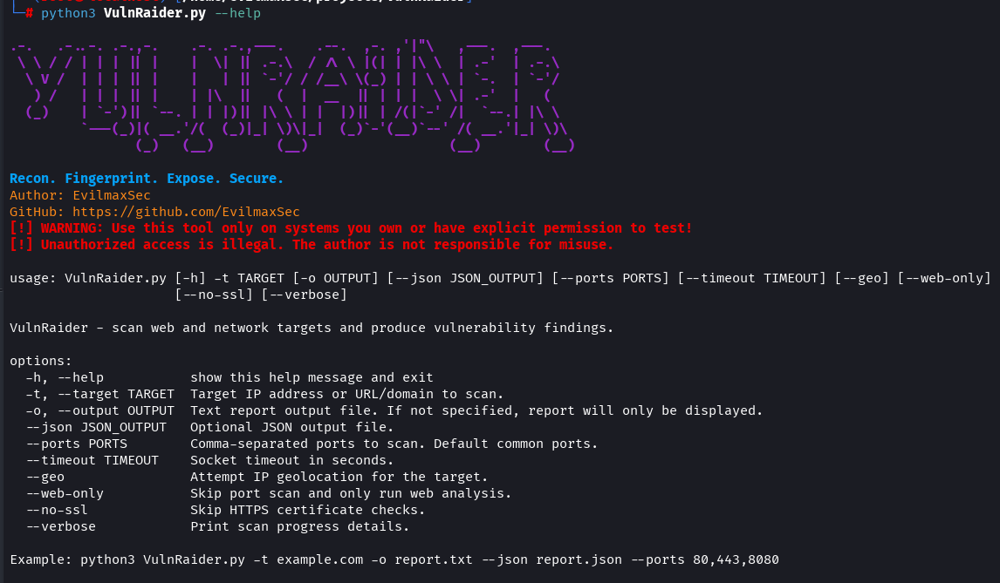
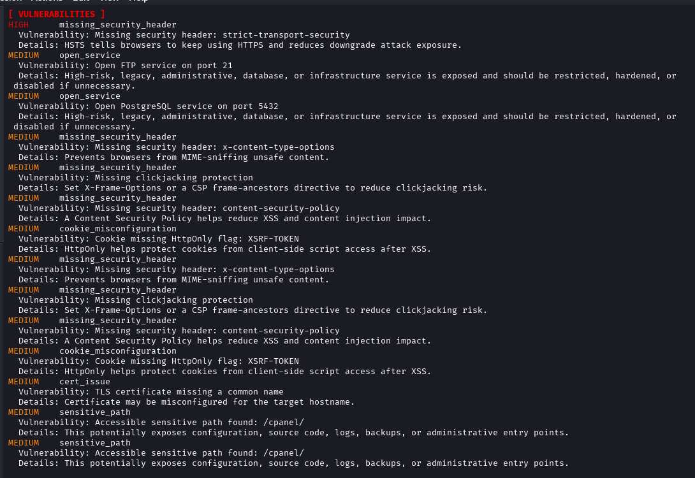

# VulnRaider

`VulnRaider` is a effective, fast, and professional Python CLI scanner for authorized reconnaissance. It fingerprints exposed services, checks common web weaknesses and misconfigurations, discovers common subdomains, inspects TLS certificate details, and prints a focused report with open ports, versions, interesting paths, and vulnerability findings.

Author: **EvilmaxSec** for security learners, bug bounty hunters, sysadmins, and ethical hackers who want a lightweight first-pass scanner before deeper testing.

<p align="center">
  
</p>

```text
Recon. Fingerprint. Expose. Secure.
```

## Preview

### 🔥VulnRaider

<video src="assets/short/short.mp4" autoplay loop muted playsinline controls width="100%"></video>

### Screenshots

<p align="center">
  
  
</p>

## Why VulnRaider

- Clear terminal reports with only useful scan information.
- Larger built-in port list for common web, database, remote access, cache, and admin services.
- Service names and lightweight version/banner fingerprints.
- Common subdomain discovery using DNS lookups.
- Web checks for missing hardening headers, weak cookies, exposed paths, CORS issues, risky HTTP methods, default pages, directory listing, server banners, and HTTPS issues.
- Backup, config, source-control, key, database dump, and log file path checks.
- TLS certificate inspection for quick certificate visibility.
- Optional IP geolocation for richer target context.
- Text and JSON report output for documentation and automation.
- No heavy dependencies and no noisy output by default.

## What It Checks

VulnRaider currently performs:

- TCP scanning across common ports including FTP, SSH, Telnet, SMTP, DNS, HTTP, HTTPS, SMB, RDP, MySQL, PostgreSQL, Redis, MongoDB, Elasticsearch, Docker, Memcached, VNC, WinRM, WebLogic, cPanel, WHM, and more.
- Banner grabbing for common services.
- HTTP and HTTPS response inspection.
- Subdomain discovery for names such as `www`, `mail`, `api`, `dev`, `admin`, `portal`, `vpn`, `cdn`, `git`, `backup`, `db`, and more.
- Web misconfiguration checks:
  - missing Content Security Policy
  - missing clickjacking protection
  - missing MIME-sniffing protection
  - missing HSTS on HTTPS
  - missing Referrer Policy
  - missing Permissions Policy
  - weak CSP using `unsafe-inline` or `unsafe-eval`
  - wildcard CORS
  - cookies missing `HttpOnly`, `Secure`, or `SameSite`
  - risky HTTP methods such as `PUT`, `DELETE`, `TRACE`, `CONNECT`, and `PATCH`
  - HTTP available without forcing HTTPS
  - default server pages
  - directory listing
  - verbose application errors
  - technology disclosure headers
- Security header checks:
  - `x-frame-options`
  - `content-security-policy`
  - `x-content-type-options`
  - `strict-transport-security`
- Sensitive path checks for:
  - source-control folders
  - environment files
  - config files
  - backup archives
  - SQL dumps
  - log files
  - private key paths
  - admin and login panels
- TLS certificate metadata collection.
- TLS misconfiguration checks for expired, nearly expired, self-signed, or incomplete certificate metadata.
- Optional IP geolocation.

## 🚀Installation

### 1. Clone The Repository

```bash
git clone https://github.com/EvilmaxSec/VulnRaider.git
cd VulnRaider
```
### Requirements

```bash
- Python 3.6 or higher
```

VulnRaider currently uses Python standard-library modules only.

## Usage

Basic scan:

```bash
python3 VulnRaider.py -t example.com
```

Scan a URL:

```bash
python3 VulnRaider.py -t https://example.com
```

Scan a web service on a custom port:

```bash
python3 VulnRaider.py -t http://example.com:8080 --web-only
```

Scan selected ports:

```bash
python3 VulnRaider.py -t example.com --ports 21,22,25,80,443,3306,3389,6379,8080,8443
```

Run web checks only:

```bash
python3 VulnRaider.py -t example.com --web-only
```

Run with geolocation:

```bash
python3 VulnRaider.py -t example.com --geo
```

Save a text report:

```bash
python3 VulnRaider.py -t example.com -o report.txt
```

Save text and JSON reports:

```bash
python3 VulnRaider.py -t example.com -o report.txt --json report.json
```

Print detailed progress:

```bash
python3 VulnRaider.py -t example.com --verbose
```

## Options

| Option | Description |
| --- | --- |
| `-t`, `--target` | Target IP, hostname, domain, or URL. |
| `-o`, `--output` | Save a clean text report. |
| `--json` | Save structured JSON output. |
| `--ports` | Comma-separated ports to scan. |
| `--timeout` | Socket timeout in seconds. |
| `--geo` | Attempt IP geolocation. |
| `--web-only` | Skip port scanning and run web analysis only. |
| `--no-ssl` | Skip HTTPS certificate checks. |
| `--verbose` | Print detailed scan progress. |

## Example Output

```text
VulnRaider Scan Report
==========================================================
Target: example.com
IP Address: 93.184.216.34
Scan Time: 2026-04-30T19:00:00+00:00 UTC

[ OPEN PORTS ]
Port     Service      Version
-------- ------------ --------------------------------
80       HTTP         nginx/1.24.0
443      HTTPS        nginx/1.24.0

[ WEB SERVICES ]
Scheme   Status   Server
-------- -------- --------------------------------
HTTP     200      nginx/1.24.0
HTTPS    200      nginx/1.24.0

[ SUBDOMAINS ]
Host                             IP Address
-------------------------------- --------------------------------
www.example.com                  93.184.216.34
api.example.com                  93.184.216.35

[ VULNERABILITIES ]
HIGH      missing_security_header
  Vulnerability: Missing security header: strict-transport-security
  Details: This header is recommended to harden web applications.

MEDIUM    cookie_misconfiguration
  Vulnerability: Cookie missing HttpOnly flag: sessionid
  Details: HttpOnly helps protect cookies from client-side script access after XSS.
```

## 🧠Recommended Workflow

1. Start with a normal scan to identify exposed services and subdomains.
2. Review open ports and detected versions.
3. Check interesting paths for backups, configs, logs, and source-control exposure.
4. Investigate critical and high findings first.
5. Export JSON when you want to feed results into another tool.
6. Use specialist scanners for deeper exploitation and validation.

## 🛠️Requirements

- Python 3.9 or newer.
- Linux, macOS, Windows, or any environment with Python socket support.
- Permission to scan the target.

## 🚨Legal Notice

Use VulnRaider only on systems you own or have explicit permission to test. Unauthorized scanning, exploitation, or access is illegal. The author is not responsible for misuse.

## Happy Hacking.!💻

## License

Released under the [MIT License](LICENSE).
